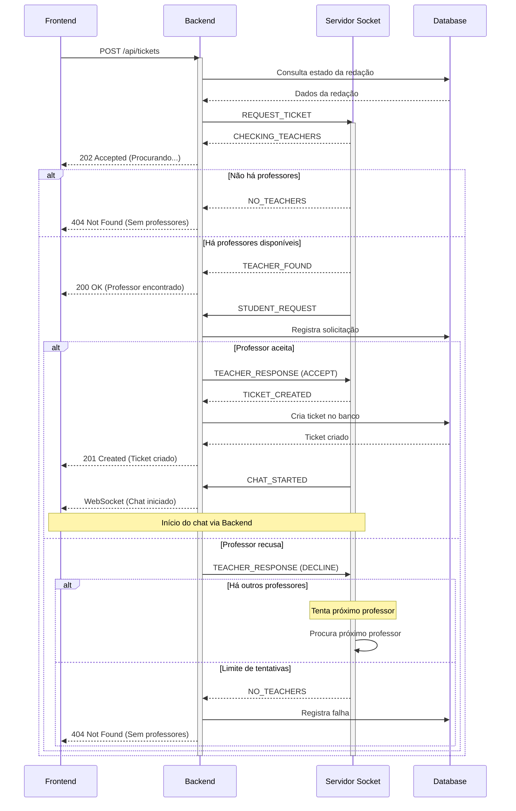

# Servidor de Tickets - Corrige.ai
Servidor Java implementado com Sockets puros para gerenciar a comunicação em tempo real do sistema de tickets/dúvidas. Este servidor atua como um microserviço especializado em gerenciar conexões em tempo real, se comunicando exclusivamente com o Backend principal da aplicação.

## Arquitetura
- **Frontend**: Comunica apenas com o Backend via REST e WebSocket
- **Backend**: 
  - Gerencia regras de negócio
  - Comunica com o banco de dados
  - Comunica com o Servidor Socket para gestão de conexões em tempo real
- **Servidor Socket**: 
  - Gerencia conexões em tempo real
  - Mantém estado das conexões ativas
  - Implementa lógica de filas e distribuição
- **Database**: 
  - Armazena dados persistentes
  - Gerenciado pelo Backend

## Processo Escolhido (MVP)
Sistema de comunicação via tickets para dúvidas sobre redações corrigidas, permitindo:
- Frontend solicita abertura de ticket via Backend
- Backend valida solicitação e comunica com Servidor Socket
- Servidor Socket gerencia fila e disponibilidade de professores
- Backend persiste todas as interações no banco de dados

## Endpoint (Socket)
- **Host**: localhost
- **Porta**: 3001
- **Protocolo**: TCP/IP
- **Conexão**: Persistente

## Exemplos de Payloads

### 1. Iniciar Conexão Socket
```json
// Backend -> Servidor
{
    "tipo": "CONNECT",
    "dados": {
        "userId": "abc123",         // ID do usuário já logado no sistema
        "userType": "STUDENT",      // STUDENT ou TEACHER
        "authToken": "xyz789"       // Token de autenticação do backend
    }
}

// Servidor -> Backend (Sucesso)
{
    "tipo": "CONNECT_SUCCESS",
    "dados": {
        "socketId": "socket123",
        "timestamp": 1698948600000
    }
}
```

### 2. Processo de Abertura de Ticket

#### 2.1 Solicitação Inicial
```json
// Cliente -> Servidor
{
    "tipo": "REQUEST_TICKET",
    "dados": {
        "redacaoId": "red123",
        "competencia": 1,
        "duvida": "Não entendi por que perdi 40 pontos na competência 1. Poderia explicar melhor?",
        "timestamp": 1698948600000
    }
}

// Servidor -> Cliente (Verificando professores)
{
    "tipo": "CHECKING_TEACHERS",
    "dados": {
        "status": "SEARCHING",
        "message": "Procurando professores disponíveis...",
        "timestamp": 1698948600000
    }
}
```

#### 2.2 Sem Professores Disponíveis
```json
// Servidor -> Cliente
{
    "tipo": "NO_TEACHERS",
    "dados": {
        "status": "FAILED",
        "message": "Não há professores disponíveis no momento. Tente novamente mais tarde.",
        "timestamp": 1698948600000
    }
}
```

#### 2.3 Professor Encontrado
```json
// Servidor -> Cliente
{
    "tipo": "TEACHER_FOUND",
    "dados": {
        "status": "WAITING",
        "message": "Professor encontrado! Aguardando aceitação...",
        "queuePosition": 1,
        "timestamp": 1698948600000
    }
}

// Servidor -> Professor
{
    "tipo": "STUDENT_REQUEST",
    "dados": {
        "requestId": "req123",
        "studentName": "João",
        "redacaoId": "red123",
        "competencia": 1,
        "duvida": "Não entendi por que perdi 40 pontos na competência 1. Poderia explicar melhor?",
        "timestamp": 1698948600000
    }
}
```

#### 2.4 Resposta do Professor
```json
// Professor -> Servidor
{
    "tipo": "TEACHER_RESPONSE",
    "dados": {
        "requestId": "req123",
        "response": "ACCEPT",  // ou "DECLINE"
        "timestamp": 1698948600000
    }
}

// Se aceito - Servidor -> Ambos
{
    "tipo": "TICKET_CREATED",
    "dados": {
        "ticketId": "ticket123",
        "status": "ACTIVE",
        "studentId": "abc123",
        "teacherId": "prof456",
        "timestamp": 1698948600000
    }
}

// Se recusado - Servidor procura outro professor ou retorna NO_TEACHERS
```

#### 2.5 Diagrama de Sequência


#### 2.6 Chat Iniciado
```json
// Servidor -> Ambos
{
    "tipo": "CHAT_STARTED",
    "dados": {
        "ticketId": "ticket123",
        "participants": {
            "student": {
                "id": "abc123",
                "name": "João"
            },
            "teacher": {
                "id": "prof456",
                "name": "Prof. Maria"
            }
        },
        "timestamp": 1698948600000
    }
}
```

### 3. Enviar Mensagem no Ticket
```json
// Cliente -> Servidor
{
    "tipo": "SEND_MESSAGE",
    "dados": {
        "ticketId": "ticket123",
        "conteudo": "Além disso, gostaria de saber como melhorar minha argumentação.",
        "timestamp": 1698948600000
    }
}

// Servidor -> Remetente (Confirmação)
{
    "tipo": "MESSAGE_SENT",
    "dados": {
        "messageId": "msg123",
        "status": "DELIVERED",
        "timestamp": 1698948600000
    }
}

// Servidor -> Destinatário (Nova mensagem)
{
    "tipo": "NEW_MESSAGE",
    "dados": {
        "messageId": "msg123",
        "ticketId": "ticket123",
        "senderId": "abc123",
        "senderName": "João",
        "conteudo": "Além disso, gostaria de saber como melhorar minha argumentação.",
        "timestamp": 1698948600000
    }
}
```

### 4. Marcar Mensagem Como Lida
```json
// Cliente -> Servidor
{
    "tipo": "MARK_AS_READ",
    "dados": {
        "ticketId": "ticket123",
        "messageId": "msg123",
        "timestamp": 1698948600000
    }
}

// Servidor -> Outro usuário
{
    "tipo": "MESSAGE_READ",
    "dados": {
        "ticketId": "ticket123",
        "messageId": "msg123",
        "readBy": "abc123",
        "timestamp": 1698948600000
    }
}
```

### 5. Fechar Ticket
```json
// Cliente -> Servidor
{
    "tipo": "CLOSE_TICKET",
    "dados": {
        "ticketId": "ticket123",
        "motivo": "RESOLVED",       // RESOLVED, ABANDONED, etc
        "timestamp": 1698948600000
    }
}

// Servidor -> Todos envolvidos
{
    "tipo": "TICKET_CLOSED",
    "dados": {
        "ticketId": "ticket123",
        "closedBy": "abc123",
        "motivo": "RESOLVED",
        "timestamp": 1698948600000
    }
}
```

## Classes Principais

### 1. `ServidorTicket.java`
```java
public class ServidorTicket {
    public static String PORTA_PADRAO = "3001";
    private ArrayList<ParceiroTicket> usuarios;
    private Queue<SolicitacaoTicket> filaEspera;
    private ArrayList<ParceiroTicket> professoresDisponiveis;
    
    public static void main(String[] args) {
        // Inicializa servidor na porta 3001
        // Gerencia lista de conexões e fila de espera
        // Mantém lista de professores disponíveis
        // Aceita comandos administrativos
    }
    
    private void distribuirSolicitacao(SolicitacaoTicket solicitacao) {
        // Procura professor disponível
        // Adiciona à fila se necessário
        // Gerencia timeouts e redistribuição
    }
}
```

### 2. `ParceiroTicket.java`
```java
public class ParceiroTicket {
    private Socket conexao;
    private ObjectInputStream receptor;
    private ObjectOutputStream transmissor;
    private String userId;
    private String userType; // "STUDENT" ou "TEACHER"
    
    // Gerencia comunicação individual com cada cliente
}
```

### 3. `SupervisorTicket.java`
```java
public class SupervisorTicket extends Thread {
    private ParceiroTicket usuario;
    private MongoDatabase database;
    private String ticketAtual;
    private ServidorTicket servidor;
    
    public void run() {
        // Processa mensagens do cliente
        // Gerencia fila de espera se professor
        // Controla timeout de aceitação
        // Salva no MongoDB
        // Gerencia estado do ticket
    }
    
    private void processarSolicitacao(SolicitacaoTicket solicitacao) {
        // Verifica disponibilidade do professor
        // Gerencia tempo de resposta
        // Estabelece conexão se aceito
    }
}

### 4. `SolicitacaoTicket.java`
```java
public class SolicitacaoTicket {
    private String requestId;
    private ParceiroTicket aluno;
    private String redacaoId;
    private int competencia;
    private String duvida;
    private long timestamp;
    private int tentativas;  // número de professores que já recusaram
    
    public boolean podeRedirecionar() {
        return tentativas < 3;  // máximo de tentativas antes de desistir
    }
}
```

### 4. `Comunicados` (Mensagens)
```java
// Tipos de mensagens trocadas
public class MensagemTicket extends Comunicado {
    private String ticketId;
    private String conteudo;
    private String remetente;
    private long timestamp;
}

public class StatusTicket extends Comunicado {
    private String ticketId;
    private String status; // ABERTO, EM_ANDAMENTO, FECHADO
}